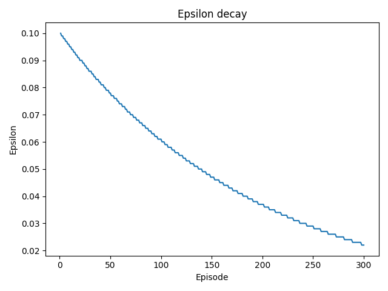
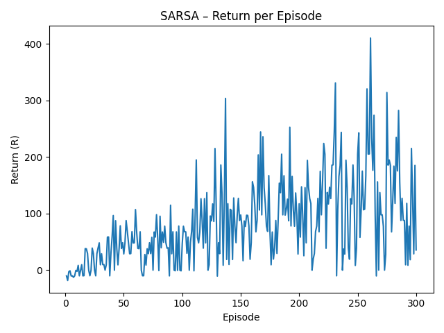
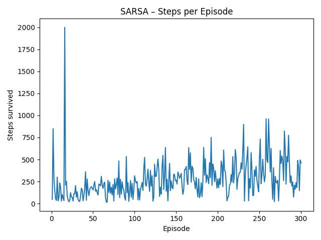

# 🐍 Snake Game + SARSA Reinforcement Learning

Ce projet combine un **jeu Snake classique** (jouable avec `turtle`) et un **agent SARSA** qui apprend à jouer **automatiquement** en utilisant les principes fondamentaux du **Reinforcement Learning (RL)**.

---

## Partie 1 : Le jeu Snake
Le fichier [`snake_game.py`](snake_game.py) contient le jeu Snake original, contrôlable au clavier :

- `Z / S / Q / D` → se déplacer (haut / bas / gauche / droite)  
- `Échap` → quitter le jeu  

Le joueur contrôle un serpent qui grandit en mangeant de la nourriture rouge.  
Chaque collision avec un mur ou son propre corps redémarre la partie.  
Le **score** et le **high score** sont affichés à l’écran.

---

## Partie 2 : L’agent SARSA (On-Policy RL)

Le fichier [`sarsa_agent.py`](sarsa_agent.py) contient un **agent SARSA** qui apprend à jouer sur une grille abstraite (simulation du jeu).

### Principe de l’algorithme SARSA
SARSA (State–Action–Reward–State–Action) est une méthode **on-policy**, c’est-à-dire que :
> L’agent apprend en suivant **la même politique ε-greedy** qu’il utilise pour agir.

Formule de mise à jour :
\[
Q(s,a) \leftarrow Q(s,a) + \alpha \big[ r + \gamma Q(s',a') - Q(s,a) \big]
\]

où :
- **α (alpha)** → taux d’apprentissage  
- **γ (gamma)** → facteur de discount (poids du futur)  
- **ε (epsilon)** → taux d’exploration (probabilité de choisir une action aléatoire)

---

## Résultats d’apprentissage

### Décroissance de l’exploration
L’agent commence par **explorer (ε=0.1)**, puis devient plus **déterministe (ε=0.02)** :

### Performance (Return par épisode)
On observe une amélioration progressive du score cumulé :

### Survie (Steps par épisode)
Le nombre d’étapes avant la mort du serpent augmente globalement :

---

## Hyperparamètres utilisés (possibilité de modifier)

| Paramètre | Valeur | Rôle |
|------------|---------|------|
| `ALPHA` | 0.2 | Taux d’apprentissage |
| `GAMMA` | 0.95 | Pondération du futur |
| `EPSILON` | 0.1 | Exploration initiale |
| `EPS_DECAY` | 0.995 | Réduction de l’exploration |
| `EPS_MIN` | 0.02 | Exploration minimale |
| `EPISODES` | 300 | Nombre d’épisodes d’apprentissage |

---

## 🧾 Exemple de sortie console

